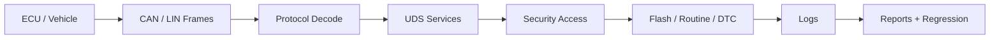

<div align="center">


<br />
<br />

<a href="https://github.com/LoveWonYoung">
  
</a>


<br />
<br />


</div>

---

<table>
<tr>
<td width="52%" valign="top">

## Operator

我是 **lm**，专注于 **汽车电子、车载诊断、Bootloader、工程自动化**。

I build tools that make low-level vehicle software easier to inspect, test, flash, and ship.

```text
identity.boot()
├─ role       : automotive embedded software developer
├─ protocols  : CAN / LIN / UDS / DTC
├─ focus      : diagnostics, flashing, validation
├─ languages  : Go / Rust / Python / C
└─ principle  : observable, repeatable, reliable
```

</td>
<td width="48%" valign="top">

## Live Telemetry


</td>
</tr>
</table>

## Control Matrix

<table>
<tr>
<td width="25%" align="center">

**Bus Layer**

`CAN` `LIN`

Message trace, decoding, timing, signal inspection.

</td>
<td width="25%" align="center">

**Diagnostic Layer**

`UDS` `DTC`

Session control, security access, routine control.

</td>
<td width="25%" align="center">

**Flash Layer**

`Bootloader`

Erase, download, transfer, verify, reset.

</td>
<td width="25%" align="center">

**Automation Layer**

`CLI` `Scripts`

Regression, logs, reports, repeatable workflows.

</td>
</tr>
</table>

## Tool Arsenal

<div align="center">


</div>

| Zone | What I Care About | Output |
| --- | --- | --- |
| Embedded | deterministic behavior, clear state machines | firmware workflow that can be reasoned about |
| Diagnostics | service flow, error recovery, traceability | UDS tooling and test automation |
| Bootloader | security access, transfer reliability, validation | stable flashing pipeline |
| Engineering | reproducible scripts, useful logs, fast feedback | tools that reduce manual debugging |

## Signal Route



## Build Modes

<table>
<tr>
<td width="33%" valign="top">

### Diagnostic Console

- UDS service verification
- DTC read / clear workflows
- Message trace analysis
- Negative response handling

</td>
<td width="33%" valign="top">

### Flash Pipeline

- Session transition
- Seed-key access
- Block transfer
- Verify and reset strategy

</td>
<td width="33%" valign="top">

### Automation Rig

- CLI tooling
- Batch validation
- Log parsing
- Regression reports

</td>
</tr>
</table>

## Repository Radar

<div align="center">

<a href="https://github.com/LoveWonYoung?tab=repositories">
  
</a>


</div>

<details>
<summary><strong>Open the diagnostics terminal</strong></summary>

```text
ecu.attach --bus can0 --protocol uds

[OK] default_session        -> extended_session
[OK] security_access        -> unlocked
[OK] routine_control        -> running
[OK] request_download       -> accepted
[OK] transfer_data          -> verified
[OK] ecu_reset              -> completed

report.write("observable_vehicle_software.md")
```

</details>

## Activity Grid

<div align="center">


<br />
<br />


<br />
<br />


</div>

## Contribution Stream

<div align="center">

<picture>
  <source media="(prefers-color-scheme: dark)" srcset="https://raw.githubusercontent.com/LoveWonYoung/LoveWonYoung/output/github-contribution-grid-snake-dark.svg" />
  <source media="(prefers-color-scheme: light)" srcset="https://raw.githubusercontent.com/LoveWonYoung/LoveWonYoung/output/github-contribution-grid-snake.svg" />
  
</picture>

</div>

## Current Packet

```go
type Packet struct {
    Name      string
    Domain    string
    Protocols []string
    Mission   string
}

packet := Packet{
    Name:      "lm",
    Domain:    "Automotive Embedded Software",
    Protocols: []string{"CAN", "LIN", "UDS", "DTC"},
    Mission:   "Build reliable tools for vehicle software workflows",
}
```

---

<div align="center">


**Vehicle software should be testable, traceable, and calm under pressure.**

<br />
<br />


</div>
