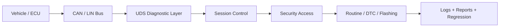

<div align="center">


<br />


<br />
<br />

<a href="https://github.com/LoveWonYoung">
  
</a>


<br />
<br />


</div>

---


## Hi, I'm lm

我是 **嵌入式软件开发者**，方向是 **汽车电子 / 车载诊断 / Bootloader / 工程自动化**。

I like turning low-level signals and complex protocol flows into tools that are reliable, testable, and easy to use.

```text
diagnostic.session.active
├─ CAN / LIN       -> bus communication and message analysis
├─ UDS             -> diagnostic services and test automation
├─ Bootloader      -> flashing flow, security access, validation
├─ Go / Rust       -> fast, dependable engineering tools
└─ Python          -> automation, scripts, data processing
```

<br clear="right" />

## Mission Control

<div align="center">

| Runtime | Signal |
| --- | --- |
| `domain` | Automotive Embedded Software |
| `protocols` | CAN / LIN / UDS / DTC |
| `toolbox` | Go / Rust / Python / C |
| `mode` | Diagnostics, flashing, validation, automation |
| `objective` | Make vehicle software workflows observable and repeatable |

</div>

## Cyber Console

```ansi
┌─ ECU DIAGNOSTIC CONSOLE ─────────────────────────────────────────────┐
│  node: LoveWonYoung                                                  │
│  bus : CAN / LIN                                                     │
│  uds : session_control | security_access | routine_control | dtc      │
│  boot: erase -> download -> transfer -> verify -> reset              │
│  lang: Go / Rust / Python / C                                        │
└──────────────────────────────────────────────────────────────────────┘
```

## Tech Radar

<div align="center">


</div>

| Embedded Core | Protocol Layer | Toolchain | Delivery |
| --- | --- | --- | --- |
| Automotive Electronics | CAN | Go | Test Automation |
| Bootloader | LIN | Rust | CLI Tooling |
| Firmware Workflow | UDS | Python | Protocol Analysis |
| ECU Diagnostics | DTC | C / Embedded C | Reliable Delivery |

## What I Build

- **Diagnostic Toolkit**：UDS 服务验证、报文跟踪、自动化回归测试。
- **Flash Pipeline**：会话控制、安全访问、分块传输、校验与异常恢复。
- **Engineering Automation**：日常调试、日志分析、批量测试、CLI 自动化。
- **Protocol Systems**：让 CAN / LIN / UDS 行为可观察、可复现、可维护。

## Diagnostic Flow



## Project Flight Deck

<div align="center">

<a href="https://github.com/LoveWonYoung?tab=repositories">
  
</a>

</div>

<details>
<summary><strong>Open engineering dashboard</strong></summary>

```text
repo.scan()
├─ profile README       -> visual identity and live telemetry
├─ diagnostics          -> protocol validation mindset
├─ automation           -> repeatable scripts and CLI workflows
└─ next target          -> publish more embedded tooling projects
```

</details>

## GitHub Snapshot

<div align="center">


<br />
<br />


<br />
<br />


</div>

## Contribution Snake

<div align="center">

<picture>
  <source media="(prefers-color-scheme: dark)" srcset="https://raw.githubusercontent.com/LoveWonYoung/LoveWonYoung/output/github-contribution-grid-snake-dark.svg" />
  <source media="(prefers-color-scheme: light)" srcset="https://raw.githubusercontent.com/LoveWonYoung/LoveWonYoung/output/github-contribution-grid-snake.svg" />
  
</picture>

</div>

## Current Signal

```go
type Developer struct {
    Name      string
    Domain    string
    Protocols []string
    Tools     []string
}

lm := Developer{
    Name:      "lm",
    Domain:    "Automotive Embedded Software",
    Protocols: []string{"CAN", "LIN", "UDS"},
    Tools:     []string{"Go", "Rust", "Python"},
}
```

---

<div align="center">


**Building reliable diagnostic and automation tools for vehicle software.**

<br />
<br />


</div>
